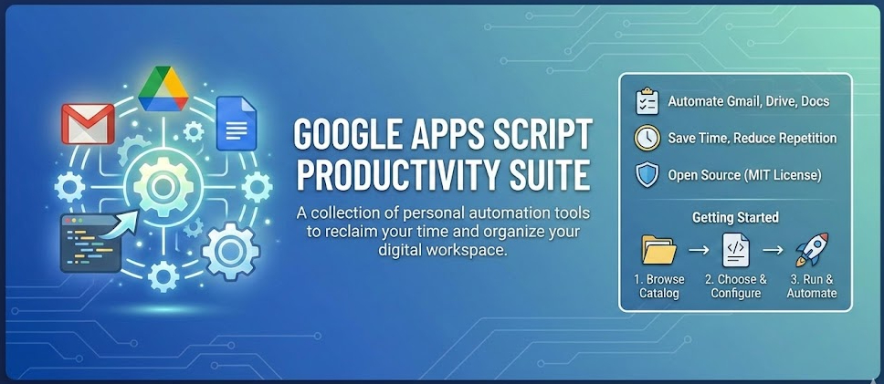

# Google Apps Script Productivity Suite

A collection of personal productivity scripts built on Google Apps Script. These tools are designed to automate repetitive tasks across Gmail, Google Drive, and Google Docs, helping you reclaim your time and keep your digital workspace organized.

Open sourced under the MIT License to help others build their own automation workflows.

## 📂 Script Catalog

| Script Name                  | Description                                                                                                                                                                                                                                       | Documentation                                           |
| :--------------------------- | :------------------------------------------------------------------------------------------------------------------------------------------------------------------------------------------------------------------------------------------------ | :------------------------------------------------------ |
| **Gmail to Drive By Labels** | Automatically archives emails from specific Gmail labels into a Google Doc (text) and Google Drive Folder (attachments). Features robust text cleaning (removing quoted replies/legal footers) and smart content-based attachment de-duplication. | [View Readme](./src/gmail-to-drive-by-labels/README.md) |
| **Calendar to Sheets**       | Syncs Google Calendar events into a Google Sheet, keeping rows up to date on changes and deletions.                                                                                                                                               | [View Readme](./src/calendar-to-sheets/README.md)       |

## 🚀 Getting Started

### Option A — Browser-based deployment (recommended)

Deploy any script directly from your browser in four steps — no command line required.

1.  **Open the deployment page** — `deploy/index.html` (or the hosted GitHub Pages version if available).
2.  **Review authentication details** — the deployment page uses a preconfigured OAuth Client ID defined in `deploy/index.html`. If you are using this repository as-is, you do not need to create or enter your own client ID. If you fork this repo and want to use your own, see the GCP setup section below and [deploy/index.html](./deploy/index.html) for details.
3.  **Sign in with Google** — authorise the page to create Apps Script projects on your behalf.
4.  **Select a script and click Deploy** — the page fetches the latest source files from this repository, uploads them to your account, and creates a new Apps Script project with an auto-generated name (you can rename it later in the Apps Script editor). A direct link to the new Apps Script project is shown on success.

After deployment, open the project in Google Apps Script and update the `config.gs` values (IDs, label names, etc.) following the specific script's `README.md`.

### Option B — Manual copy-paste

1.  **Browse the Catalog:** Check the table above to find a script that fits your needs.
2.  **Open the Folder:** Navigate to the specific script folder (e.g., `/src/gmail-to-drive-by-labels`).
3.  **Code & Config Convention:** Each script places the runnable code in `code.gs` and configuration values in `config.gs`.
4.  **Copy the Code:** Open `code.gs` (and `config.gs`) in the folder and copy them into a new [Google Apps Script project](https://script.google.com/).
5.  **Configure:** Update `config.gs` values (spreadsheet id, sheet name, etc.) and follow the specific setup instructions in that script's `README.md`.

## ⚙️ One-Time GCP Setup (For Fork Maintainers)

If you fork this repository and want to use the browser-based deployment page or the GAS Installer Web App, you must manually configure your Google Cloud Platform project once before anything will work.

### Step 1: The One-Time GCP Setup

1. Go to your [Google Cloud Console](https://console.cloud.google.com/).
2. Navigate to **APIs & Services → Library** and enable the **Google Apps Script API**.
3. Navigate to **APIs & Services → OAuth consent screen**. Set it to **External** (so anyone can use it).
4. Add the one required scope so the app can create and update Apps Script projects:
   - `https://www.googleapis.com/auth/script.projects`
5. Note your **Project Number** from the GCP dashboard. You will enter this into the **Settings → "Google Cloud Platform (GCP) Project"** section of your Installer GAS project.

## 🤝 Contributing

Contributions are welcome! If you have ideas for improvements or new scripts to add to the suite:

1.  Fork the repository.
2.  Create a feature branch (`git checkout -b feature/AmazingScript`).
3.  Commit your changes.
4.  Open a Pull Request.

## 📄 License

This project is licensed under the MIT License - see the [LICENSE](LICENSE) file for details.

---

_Note: These scripts are provided "as is". Always test on a small batch of data before running on important files._
