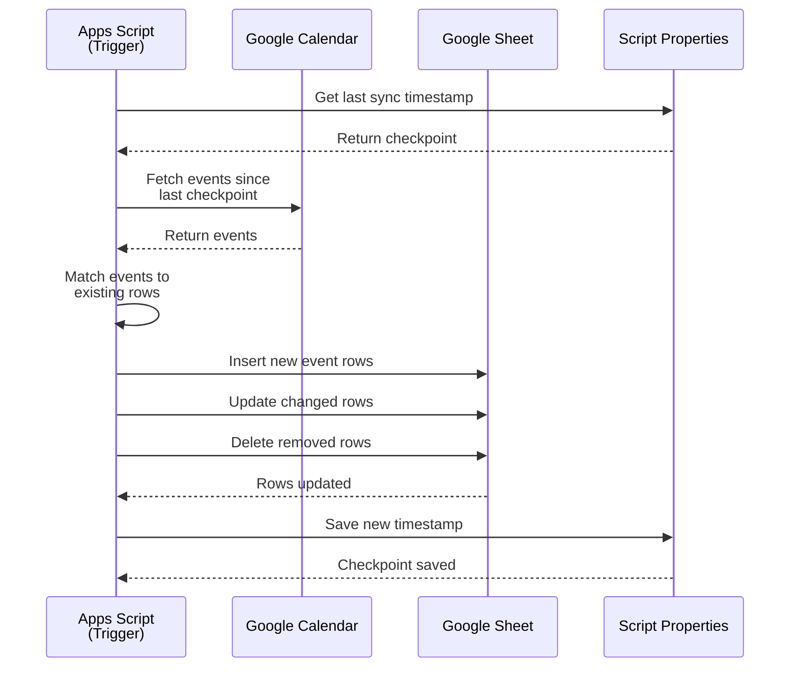

# calendar-to-sheets

Google Apps Script that syncs events from a user's primary Google Calendar into a Google Sheet.

Features:
- Writes full event details (id, title, start, end, description, location, attendees) into a sheet row.
- Updates existing rows when an event changes (no duplicates).
- Removes rows when events are deleted from the calendar.

## Sync Process



Testing & development
- Unit tests are implemented with Jest. Run `npm test` from the repo root.
- Tests are designed to run locally using the repository's `test-utils` mocks.

Usage
- The runnable Apps Script entry points live in `code.gs` and configuration values are in `config.gs`.
- Configuration now supports multiple calendar->sheet mappings via `SYNC_CONFIGS` in `config.gs` (preferred). Legacy single mapping using `SPREADSHEET_ID`, `SHEET_NAME`, and `CALENDAR_ID` is still supported.
- Use the GAS wrapper `syncCalendarToSheetGAS(startIso, endIso)` for a single mapping (legacy behavior) or `syncAllCalendarsToSheetsGAS(startIso, endIso)` to sync all mappings defined in `SYNC_CONFIGS`. Both functions accept optional `startIso`/`endIso` ISO timestamps.
- The core, testable logic lives under `src/` (`eventToRow`, `syncCalendarToSheet`, etc.) and is exercised by the included Jest tests.
## Checkpoint logic (performance optimization)

To prevent timeouts with large calendars, the script implements **intelligent checkpoint logic**:

- **First run:** Syncs events from the past year (not from epoch) to avoid timeouts with large calendars.
- **Subsequent runs:** Syncs only from the last sync time to present, processing only new/updated events.
- **Result:** Each sync is fast and incremental, with the first sync covering recent history only.
- **Full history sync:** Use `fullResyncCalendarToSheetGAS(0)` if you need to sync older events.

### Functions

- `getLastSyncTime(cfg)` — Returns the last sync timestamp for a config (or epoch if never synced).
- `saveLastSyncTime(cfg, timestamp)` — Saves checkpoint after successful sync (called automatically).
- `clearCheckpoint(cfg)` — Manually reset checkpoint to resync from epoch.
- `fullResyncCalendarToSheetGAS(configIndex)` — Full resync for a specific config (index in `SYNC_CONFIGS`).

### Example: Manual resync

```javascript
// In Google Apps Script Editor, run this for a full historical sync:

// Resync from 1 year ago (the default safe window)
fullResyncCalendarToSheetGAS(0);

// For a complete historical sync, manually adjust the start date:
// (Warning: may timeout with very large calendars)
// const cfg = SYNC_CONFIGS[0];
// clearCheckpoint(cfg);
// _syncCalendarToSheetGAS(cfg, new Date(0), new Date()); // From epoch
// saveLastSyncTime(cfg, new Date());
```

