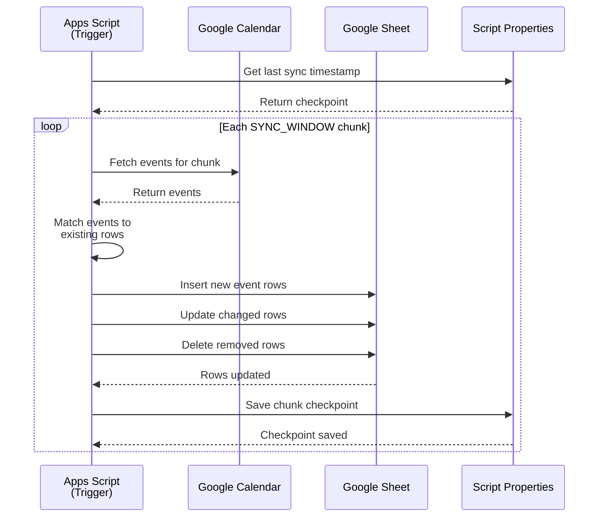

# calendar-to-sheets

Google Apps Script that syncs events from a user's primary Google Calendar into a Google Sheet.

Features:

- Writes full event details (id, title, start, end, description, location, attendees) into a sheet row.
- Updates existing rows when an event changes (no duplicates).
- Removes rows when events are deleted from the calendar.

## Sync Process


```mermaid
sequenceDiagram
    participant GAS as Apps Script<br/>(Trigger)
    participant Cal as Google Calendar
    participant Sheet as Google Sheet
    participant Props as Script Properties

    GAS->>Props: Get last sync timestamp
    Props-->>GAS: Return checkpoint

    loop Each SYNC_WINDOW chunk
        GAS->>Cal: Fetch events for chunk
        Cal-->>GAS: Return events

        GAS->>GAS: Match events to<br/>existing rows

        GAS->>Sheet: Insert new event rows
        GAS->>Sheet: Update changed rows
        GAS->>Sheet: Delete removed rows
        Sheet-->>GAS: Rows updated

        GAS->>Props: Save chunk checkpoint
        Props-->>GAS: Checkpoint saved
    end
```

Testing & development

- Unit tests are implemented with Jest. Run `npm test` from the repo root.
- Tests are designed to run locally using the repository's `test-utils` mocks.

Usage

- The runnable Apps Script entry points live in `code.gs` and configuration values are in `config.gs`.
- Configuration now supports multiple calendar->sheet mappings via `SYNC_CONFIGS` in `config.gs` (preferred). Legacy single mapping using `SPREADSHEET_ID`, `SHEET_NAME`, and `CALENDAR_ID` is still supported.
- Use the GAS wrapper `syncCalendarToSheetGAS(startIso, endIso)` for a single mapping (legacy behavior) or `syncAllCalendarsToSheetsGAS(startIso, endIso)` to sync all mappings defined in `SYNC_CONFIGS`. Both functions accept optional `startIso`/`endIso` ISO timestamps.
- The core, testable logic lives under `src/` (`eventToRow`, `syncCalendarToSheet`, etc.) and is exercised by the included Jest tests.

## Configuration

### Option A — Web-based configuration (recommended)

If you deployed the script via the browser-based deployment page (`deploy/index.html`), a **Step 4: Configure** panel appears automatically after deployment. Use the calendar dropdown to select your Google Calendar and the Drive Picker to choose the destination spreadsheet, then click **Save Configuration**. This writes `config.gs` directly to your Apps Script project — no manual editing required.

### Option B — Manual configuration

Edit `config.gs` in the Apps Script editor and update the `SYNC_CONFIGS` array:

```javascript
var SYNC_CONFIGS = [
  {
    // The Google Calendar ID to sync (find it in Google Calendar Settings → Integrate calendar)
    // Use "primary" for your main calendar
    calendarId: 'primary',

    // The Google Spreadsheet ID (found in the Sheet URL between /d/ and /edit)
    spreadsheetId: 'YOUR_SPREADSHEET_ID',

    // The name of the sheet tab to write events into (must already exist)
    sheetName: 'Sheet1',
  },
  // Add more entries to sync additional calendars to different sheets:
  // { calendarId: 'work@example.com', spreadsheetId: 'ANOTHER_ID', sheetName: 'Work' },
]
```

To find your **Spreadsheet ID**: open the sheet in your browser and copy the string between `/d/` and `/edit` in the URL.

To find your **Calendar ID**: in Google Calendar, click the three-dot menu next to a calendar → **Settings and sharing** → scroll down to **Integrate calendar** → copy the **Calendar ID**.

## Checkpoint logic (performance optimization)

To prevent timeouts with large calendars, the script implements **checkpoint logic**:

- **First run:** Syncs events from epoch to now when no checkpoint exists.
- **Subsequent runs:** Syncs only from the last sync time to present, processing only new/updated events based on the configured lookback window.
- **Result:** Each sync is incremental and resumes from the last checkpoint.
- **Full history sync:** Use `fullResyncCalendarToSheetGAS(0)` if you need to wipe and resync.

### Functions

- `getLastSyncTime(cfg)` — Returns the last sync timestamp for a config (or epoch if never synced).
- `saveLastSyncTime(cfg, timestamp)` — Saves checkpoint after successful sync (called automatically).
- `clearCheckpoint(cfg)` — Manually reset checkpoint to resync from epoch.
- `fullResyncCalendarToSheetGAS(configIndex)` — Full resync for a specific config (index in `SYNC_CONFIGS`).

### Example: Manual resync

```javascript
// In Google Apps Script Editor, run this for a full historical sync:

// Full historical resync (clears checkpoint and syncs from epoch)
fullResyncCalendarToSheetGAS(0)

// For a manual one-off window, call the sync function with explicit dates:
// syncAllCalendarsToSheetsGAS('2025-01-01', '2025-12-31');
```
