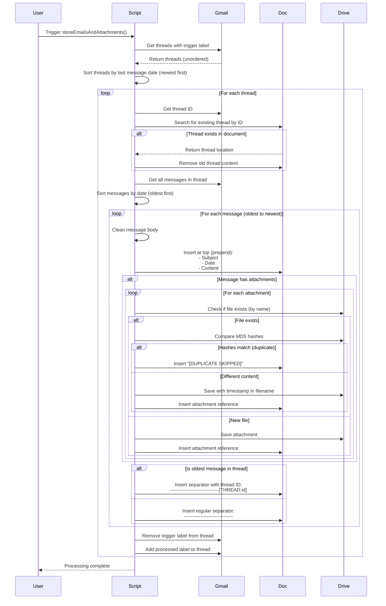

# Gmail to Drive By Labels

A robust Google Apps Script designed to automate the archiving of Gmail threads. It prepends email body text to the top of a Google Doc (newest content first) and intelligently saves attachments to a specific Google Drive folder based on Gmail labels.

## Example Use-Cases

### 1. Collect and store all documents related to an ongoing topic into Google Drive which can act as a source of grounding for a Notebook system. Use Gmail Filters to automatically label incoming emails and have them feed into your Notebook RAG.

## Features

**Automated Archiving:**

- Scans for emails with a specific "Trigger Label" and processes them automatically.
- Processing is performed on a per-item basis allowing resumption after timeouts

**Thread Deduplication:**
* Prevents duplicate content when new messages arrive on existing threads
* Each thread is identified by a unique ID embedded in its separator
* Existing thread content is automatically removed and replaced with updated content
* Ensures each thread appears exactly once in the document with the latest messages

**Clean Output:**

- Strips quoted replies (e.g., "On [Date]... wrote:").
- Removes "Confidentiality Notice" legal footers.
- Removes lines starting with `>` or `<`.
- Normalizes excessive line breaks to prevent blank lines in documents.

**Content-Based De-duplication:**

- Uses MD5 hashing (digital fingerprinting) to detect if a file is an exact duplicate of one already in the folder, even if the filename is different.

**Safe Renaming:**

- If a file has the same name but _different_ content, it automatically appends a timestamp to the filename to prevent overwriting data.

**Robust Processing:**

- Includes error handling and delays to prevent Google Docs "Unexpected Error" crashes during high-volume loops.

**Label Management:**

- Automatically removes the trigger label and applies an "Archived" label after processing.

## How It Works

### End-to-End Processing Flow



### Thread Deduplication Logic

The script prevents duplicate thread content when new messages arrive on existing threads:

1. **Thread Identification**: Each thread is assigned a unique ID (via Gmail API's `thread.getId()`)

2. **Separator Marking**: The thread ID is embedded in a separator at the bottom of each thread:
   ```
   ------------------------------[THREAD:1234567890abcdef]
   ```

3. **Duplicate Detection**: Before inserting a thread, the script searches the document for the thread ID marker

4. **Content Removal**: If found, all paragraphs from the thread separator backwards to the previous separator (or document start) are removed

5. **Updated Insertion**: The complete thread with all messages (including new ones) is inserted at the top

**Result**: Each thread appears exactly once in the document, always showing the latest content.

### Message and Thread Ordering

**Thread Order** (in document):
* Threads are sorted by last message date
* Newest threads appear at the top
* Sorting happens before processing to ensure consistent order regardless of Gmail API's return order

**Message Order** (within each thread):
* Messages are sorted oldest-first before insertion
* Since messages are prepended (inserted at index 0), newest messages end up at the top
* Final result: Newest message at top, oldest at bottom of each thread

### Example Document Structure

```
Subject: Re: Important Update
Date: 2024-01-15 10:00
Newest reply content
------------------------------

Subject: Re: Important Update  
Date: 2024-01-10 15:00
Second reply content
------------------------------

Subject: Important Update
Date: 2024-01-05 09:00
Original message content
------------------------------[THREAD:abc123def456]

Subject: Another Thread
Date: 2024-01-03 14:00
Different thread content
------------------------------[THREAD:xyz789uvw012]
```

## Setup Instructions

### 1. Create the Script Files

1. Open [Google Apps Script](https://script.google.com/).
2. Create a new project.
3. Create two files in the editor:

- `Code.gs`: Paste the main logic code.
- `Config.gs`: Paste the configuration code.

### 2. Prepare Destination Files

- **Google Doc:** Create a new Google Doc (or use an existing one) to act as the log for email text.
- **Google Drive Folder:** Create a folder where attachments will be saved.

### 3. Get Your IDs

You will need to extract IDs from your browser URL bar:

- **Doc ID:** The string between `/d/` and `/edit` in the Doc URL.
- _Example:_ `https://docs.google.com/document/d/`**`1vN7xdaLW0ZDWUjgP2yJ5ETb9t3ZlDT10s9IxNOt7yXA`**`/edit`

- **Folder ID:** The string at the end of the Folder URL.
- _Example:_ `https://drive.google.com/drive/folders/`**`10s9IxNOt7yXA_Example_Folder_ID`**

## Configuration (`Config.gs`)

Open `Config.gs` and update the `PROCESS_CONFIG` array.

```javascript
function getProcessConfig() {
  return [
    {
      // The label that triggers the script
      // NOTE: For nested labels, use the full path: "Parent/Child"
      triggerLabel: 'Projects/toby-mcaa',

      // The label applied after successful processing
      processedLabel: 'Projects/toby-mcaa-archived',

      // The Google Doc ID found in step 3
      docId: 'YOUR_GOOGLE_DOC_ID_HERE',

      // The Drive Folder ID found in step 3
      folderId: 'YOUR_DRIVE_FOLDER_ID_HERE',

      // Optional: number of emails/threads to process per execution (default is 250)
      // Adjust this if you hit script timeouts during processing or rebuilds.
      batchSize: 250,
    },
  ]
}
```

## Usage

### Regular Processing

1. Select `storeEmailsAndAttachments` from the function dropdown in the Apps Script toolbar.
2. Click **Run**.
3. Grant permissions when prompted (access to Gmail, Drive, and Docs).
4. Check the **Execution Log** for progress.

### Rebuilding Documents

If you've updated the cleaning logic (e.g., `getCleanBody` function) or want to regenerate documents with new processing rules:

1. Select `rebuildAllDocs` from the function dropdown in the Apps Script toolbar.
2. Click **Run** - this will:
   - Clear all configured Google Docs
   - Move all processed/archived emails back to their trigger labels
3. Then run `storeEmailsAndAttachments` to reprocess all emails with the updated logic.

**Note:** The rebuild process moves (not copies) emails back to trigger labels, ensuring all emails are reprocessed exactly once with the latest logic while maintaining incremental processing to avoid script timeouts.

## Automation (Optional)

To run this script automatically (e.g., every hour):

1. Click on the **Triggers** icon (alarm clock) in the left sidebar.
2. Click **+ Add Trigger**.
3. **Function to run:** `storeEmailsAndAttachments`.
4. **Event source:** `Time-driven`.
5. **Type of time based trigger:** `Hour timer` (or as preferred).
6. Click **Save**.

## Cleaning Logic Details

The script uses regex patterns to clean the email body. It specifically looks for and removes:

- **Headers:** `On [Date], [Name] wrote:` (Gmail), `From: ... Sent:` (Outlook).
- **Footers:** Any line containing "Confidentiality Notice" (case-insensitive) and everything following it.
- **Quote characters:** Any line starting with `>` or `<`.

### Line Break Normalization

To prevent excessive blank lines in the generated documents, the script normalizes line breaks:

- **Behavior:** All consecutive newlines (2 or more) are replaced with a single newline.
- **Rationale:** When `insertParagraph()` inserts text into Google Docs, each `\n` character creates a paragraph break. Multiple consecutive newlines would create excessive blank lines, making documents unnecessarily long and harder to read.
- **Impact:** Email signatures and formatted content appear compact without blank lines while preserving all content.

**Example:**

Before normalization:

```
Thank you!


John Doe

Software Engineer


Acme Corp
```

After normalization (as it appears in the document):

```
Thank you!
John Doe
Software Engineer
Acme Corp
```

This ensures documents remain readable and compact, especially when processing emails with formatted signatures or multiple paragraph breaks.

## License

MIT
